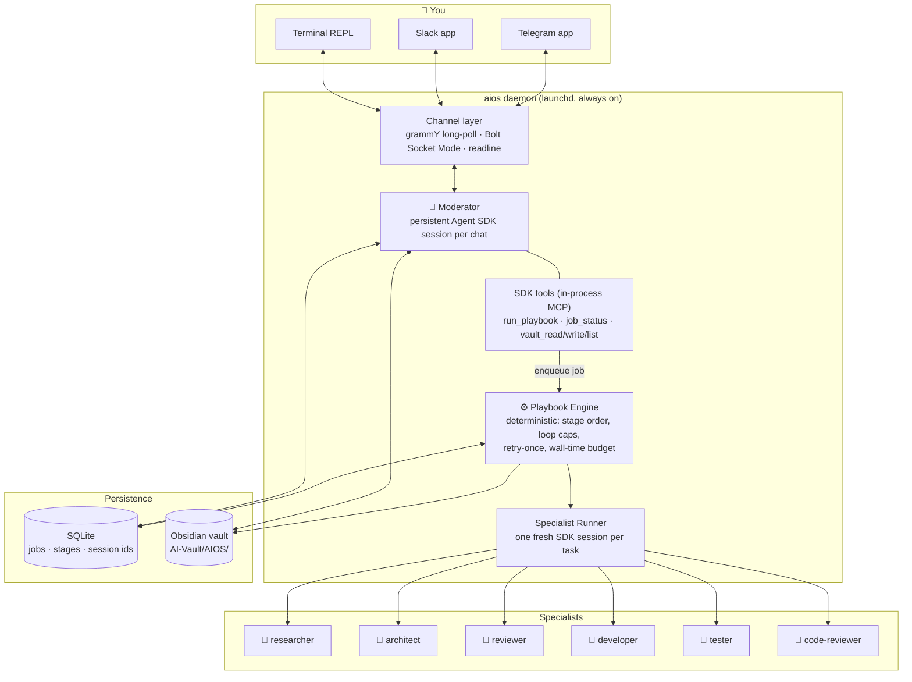
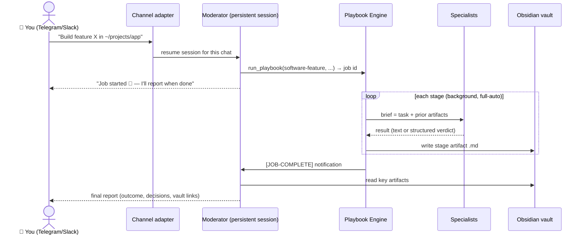
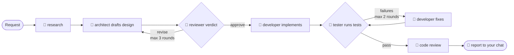
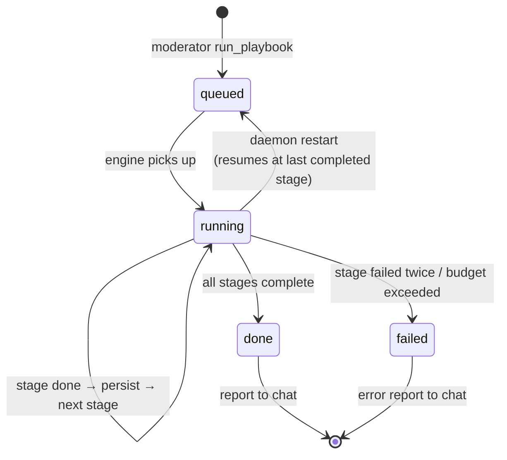
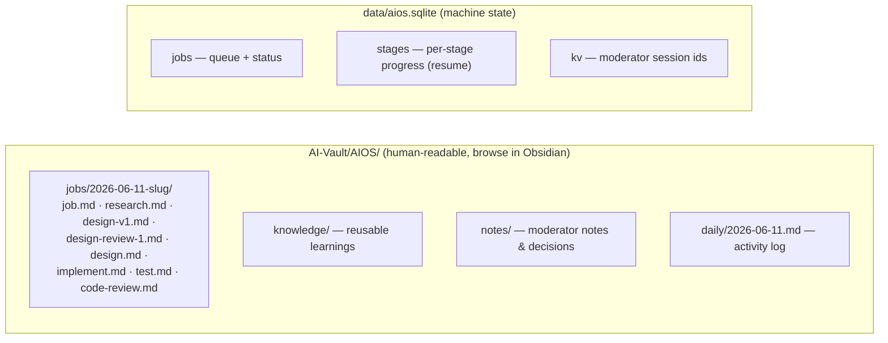

# AI-OS — Design & Architecture

A local, always-on multi-agent system built on the **Claude Agent SDK** (TypeScript, Node 23).
You chat with a **Moderator** from Telegram, Slack, or a local terminal. The Moderator
discusses, decides, and delegates execution to a team of specialist agents through
deterministic **playbooks**. Every artifact is persisted to an Obsidian vault.

Key properties:

- **Subscription-powered** — authenticates with `CLAUDE_CODE_OAUTH_TOKEN` (from `claude setup-token`). No API key, no per-token billing.
- **No public ports** — Telegram long-polling and Slack Socket Mode are outbound-only connections; works behind home NAT.
- **Deterministic where it matters** — LLM judgment for routing and content, plain TypeScript for stage ordering, loop caps, retries, and budgets.
- **Resumable** — jobs survive daemon restarts; the Moderator remembers every conversation.

---

## System overview



The Moderator never calls specialists directly. Its `run_playbook` tool **enqueues a job
and returns immediately** (SDK tool calls must stay short); the engine runs the pipeline in
the background and notifies the Moderator on completion, which then composes a report for
your chat.

---

## Message flow



Conversation memory: each chat (`channel:chatId`) maps to one persistent SDK session whose
id is stored in SQLite — the Moderator remembers context across messages **and across
daemon restarts**. Turns are serialized per chat; session ids are only persisted after
successful turns, with automatic fresh-start recovery if a stored id goes stale.

---

## The `software-feature` playbook



Loop continuation is decided by **code, not prose**: the reviewer and tester are forced
into structured JSON output (`{verdict: approve|revise, reasons[]}` /
`{passed: bool, failures[]}`) via the SDK's `outputFormat` json-schema. The engine branches
on those fields. Caps (3 design rounds, 2 fix rounds) are hard limits in the executor.

### Playbook format

Workflows are YAML in `playbooks/` — no code changes to add one. Three stage types:

| Type | Shape | Used for |
|---|---|---|
| `single` | one specialist pass | research, implementation, code review |
| `loop` | `producer` ⇄ `critic` until approve or `maxRounds` | design + review |
| `verify` | `runner` checks, `fixer` fixes, re-check up to `maxRounds` | test + fix |

Shipped playbooks: `software-feature` (full pipeline, needs project dir),
`research-report` (researcher ⇄ reviewer), `market-research` (market-researcher ⇄ reviewer),
`product-design` (market research → design brief ⇄ reviewer), `echo` (smoke test).

---

## Job lifecycle



Every stage start/finish is persisted to SQLite. If the daemon dies mid-job, launchd
restarts it and the engine re-runs the job **skipping completed stages**, rehydrating
context from the vault artifacts.

Failure policy: stage fails → one retry → job failed → error report to your chat with
vault link to partial artifacts. Per-job wall-time budget (default 2h).

---

## Specialist personas

Each specialist is a **fresh SDK session per task** with its own system prompt, tool
allowlist, permission mode, and turn cap. They don't share conversation state — context
flows through the brief (task + prior artifacts) the engine builds.

| | Persona | Tools | Permissions | Output |
|---|---|---|---|---|
| 🔎 **researcher** | Investigator. Surveys libraries, prior art, pitfalls, constraints. Cites sources. | Read, Grep, Glob, WebSearch, WebFetch | read-only (`dontAsk`) | `research.md` brief: Summary, Key findings, Recommended direction, Risks, Sources |
| 📐 **architect** | Designer. Turns request + research into a complete technical design. Revises against every reviewer point or argues why not. | Read, Grep, Glob | read-only | design doc: Overview, Architecture, Components, Data flow, Interfaces, Error handling, Testing, Steps |
| 🧐 **reviewer** | Demanding-but-fair critic. Judges completeness, correctness, simplicity (YAGNI), risks, testability. Approves "good enough to build", not perfect. | Read, Grep, Glob | read-only | structured verdict JSON: `approve`/`revise` + reasons |
| 👷 **developer** | Builder. Implements the approved design, matches existing code style, verifies builds. Fixes test failures when handed them. | Read, Grep, Glob, Edit, Write, Bash, TodoWrite | write — confined to the job's project dir under `~/projects` | code + implementation summary |
| 🧪 **tester** | Honest verifier. Discovers and runs the project's tests/build; writes smoke tests if none exist. "Never claim passing without output proving it." | Read, Grep, Glob, Edit, Write, Bash | write — same confinement | structured report JSON: `passed` + failures |
| 🔬 **code-reviewer** | Audit. Reviews the diff; reports every issue with file:line + severity, coverage over confidence. Read-only by design. | Read, Grep, Glob, Bash | read-only | findings list + overall assessment |
| 📊 **market-researcher** | Market analyst. Competitors, audience, pricing, TAM/SAM (assumptions stated), trends, gaps. Facts vs inference, every claim sourced. | Read, Grep, Glob, WebSearch, WebFetch | read-only | market report: Market, Competitors, Audience, Pricing, Trends, Opportunities, Sources |
| 🎨 **ui-ux-designer** | Product designer. Personas, mermaid user flows, IA, ASCII wireframes, design tokens, component inventory, a11y notes. Anti-generic-AI aesthetics. | Read, Grep, Glob, WebSearch, WebFetch | read-only | implementable design brief |
| 🕌 **halalo** | Halalo marketplace (CS-Cart) backend specialist. Repo expertise + live staging/production AWS inspection. Project CLAUDE.md injected at runtime. | Read/Grep/Glob (repo-confined), Bash (gated), Web | **deterministic read-only gate**: aws describe/get/list + SSM with read-only inner commands (mysql SELECT only); file reads confined to the repo; everything else denied in code | root-cause analyses with live evidence |
| 🧠 **Moderator** | Your chief of staff. Discusses, refines, routes, reports. Phone-readable replies, outcome first. Never pretends a job finished. | vault + job tools, Read, Grep, Glob, WebSearch, WebFetch | read-only + job control | chat |

Personas live in `src/agents/roles/index.ts`; the Moderator's in `src/moderator/prompt.ts`.

### Talking to specialists

Specialists are reachable three ways:

1. **Pipeline stages** — the engine briefs them inside playbook jobs (fresh session per task).
2. **Moderator consult** — the Moderator's `ask_specialist` tool runs a one-shot specialist
   call inline and uses the answer in its reply.
3. **Direct chat** — messages starting `@role ...` (or `role: ...`) bypass the Moderator;
   each specialist keeps a persistent per-chat session (own memory, resumable across daemon
   restarts), with its pipeline persona softened by a direct-chat addendum.

---

## Persistence layout



Division of labor: **vault = what humans read** (every artifact, wikilinked, with
frontmatter), **SQLite = what the machine needs** (resume state, queue, session ids).
Secrets live only in `.env`.

---

## Guarded roles (deterministic tool gates)

Roles can carry per-tool checks (`RoleDef.toolChecks`) enforced in code, not prompts.
Two layers, because the SDK's permission paths differ (verified empirically, SDK 0.3.173):

- **PreToolUse hook** — fires for *every* tool call, including tools auto-classified
  "safe" (Read/Grep) and tools pre-approved via `allowedTools`. The only always-on layer.
- **canUseTool** — the programmatic permission prompt; decides for tools that reach the
  permission flow (e.g. Bash under `permissionMode: "default"`). Allow responses must
  include `updatedInput`.

The halalo gate (`src/agents/guards/halalo-readonly.ts`) parses each Bash command:
rejects shell composition/redirection, requires `--profile halalo|halalo-staging-new`,
allows only read-only AWS actions, and for `ssm send-command` validates the *inner*
commands against their own allowlist (log tails, status, `mysql -e "SELECT…"` with
write-keyword rejection). The finance agent uses the same mechanism to confine invoice
reading to the vault's finance folder.

## Security model

- Telegram locked to allowlisted user ids; everyone else gets "Not authorized."
- Moderator's `run_playbook` refuses any `project_dir` outside `AIOS_PROJECTS_ROOT` (default `~/projects`).
- Write-capable roles (developer, tester) run with bypassed permission prompts but only inside the job's project directory; all other roles are read-only.
- Nothing secret is ever written to the vault.

## Model selection

No model is hardcoded. Headless SDK sessions currently resolve to `claude-opus-4-8`.
Override per tier in `.env`:

```bash
AIOS_MODERATOR_MODEL=claude-opus-4-8
AIOS_SPECIALIST_MODEL=claude-sonnet-4-6
```

## Repository map

```
src/
  index.ts            daemon entry: channels + moderator + job manager wiring
  config.ts           env + paths
  channels/           types.ts · telegram.ts · slack.ts · cli.ts
  moderator/          session.ts (persistent sessions) · tools.ts (SDK MCP tools) · prompt.ts
  engine/             playbook.ts (YAML+zod) · executor.ts (stage machine) · jobs.ts (queue)
  agents/             runner.ts (SDK session per task) · roles/index.ts (personas)
  store/db.ts         SQLite (node:sqlite)
  vault/writer.ts     markdown artifacts, daily log
playbooks/            software-feature · research-report · echo
launchd/              com.ihab.aios.plist
scripts/smoke.ts      one-shot end-to-end test
test/                 executor + playbook unit tests
```
