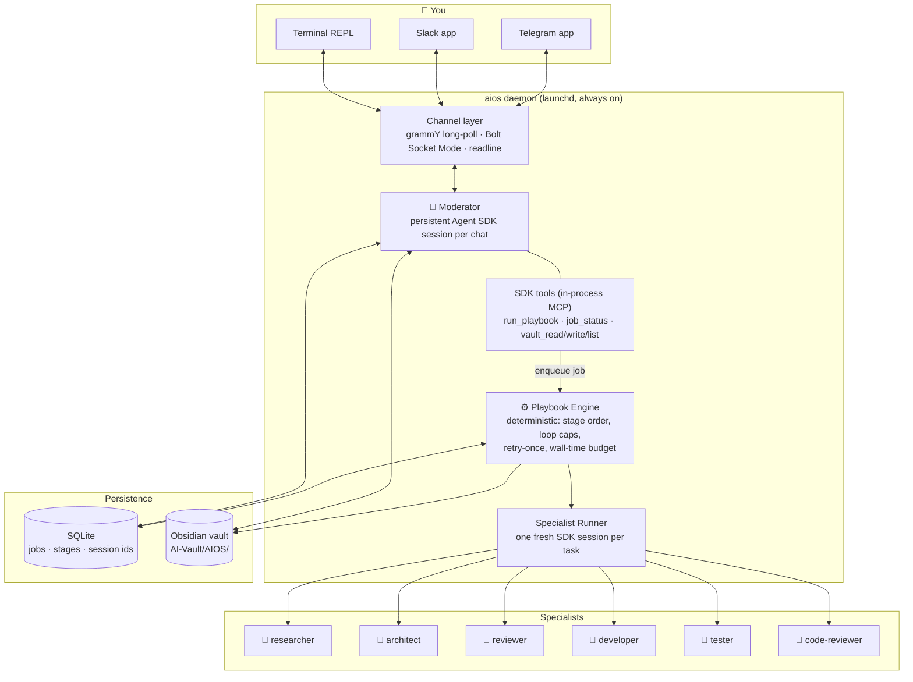
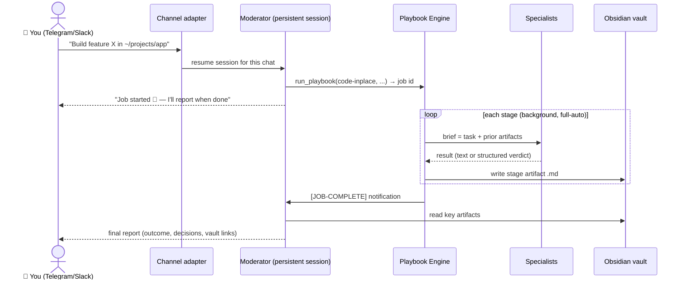
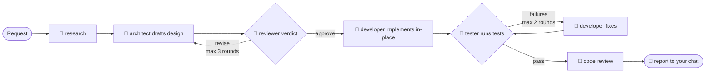
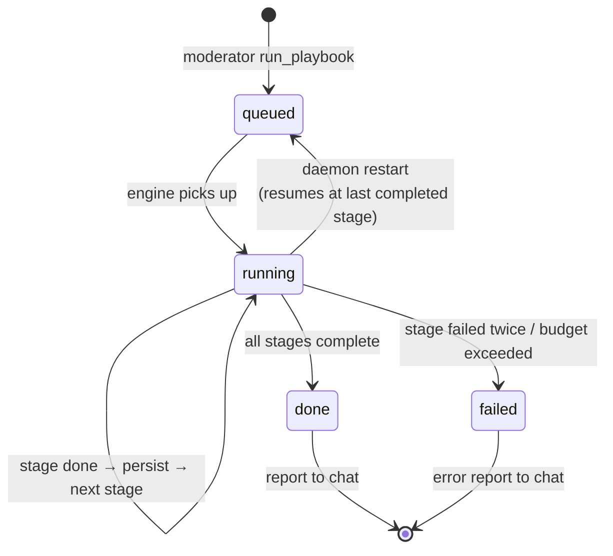
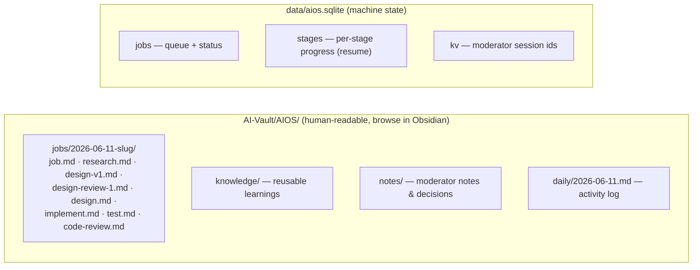

# AI-OS — Design & Architecture

A local, always-on multi-agent system built on the **Claude Agent SDK** (TypeScript, Node 23).
You chat with a **Moderator** from Telegram, Slack, or a local terminal. The Moderator
discusses, decides, and delegates execution to a team of specialist agents through
deterministic **playbooks**. Every artifact is persisted to an Obsidian vault.

Key properties:

- **Subscription-powered** — authenticates with `CLAUDE_CODE_OAUTH_TOKEN` (from `claude setup-token`). No API key, no per-token billing.
- **No public ports** — Telegram long-polling and Slack Socket Mode are outbound-only connections; works behind home NAT.
- **Deterministic where it matters** — LLM judgment for routing and content, plain TypeScript for stage ordering, loop caps, retries, and budgets.
- **Resumable** — jobs survive daemon restarts; the Moderator remembers every conversation.

---

## System overview



The Moderator never calls specialists directly. Its `run_playbook` tool **enqueues a job
and returns immediately** (SDK tool calls must stay short); the engine runs the pipeline in
the background and notifies the Moderator on completion, which then composes a report for
your chat.

---

## Message flow



Conversation memory: each chat (`channel:chatId`) maps to one persistent SDK session whose
id is stored in SQLite — the Moderator remembers context across messages **and across
daemon restarts**. Turns are serialized per chat; session ids are only persisted after
successful turns, with automatic fresh-start recovery if a stored id goes stale.

---

## The coding playbooks (code_task)

All coding flows through one `code_task(mode)` tool: `build` (sandboxed worktree, default), `analyze` (read-only audit), `inplace` (edits your real checkout — not sandboxed, reachable only by explicit request and blocked from the AIOS source tree). `run_playbook` does not run code playbooks.



Loop continuation is decided by **code, not prose**: the reviewer and tester are forced
into structured JSON output (`{verdict: approve|revise, reasons[]}` /
`{passed: bool, failures[]}`) via the SDK's `outputFormat` json-schema. The engine branches
on those fields. Caps (3 design rounds, 2 fix rounds) are hard limits in the executor.

### Playbook format

Workflows are YAML in `playbooks/` — no code changes to add one. Three stage types:

| Type | Shape | Used for |
|---|---|---|
| `single` | one specialist pass | research, implementation, code review |
| `loop` | `producer` ⇄ `critic` until approve or `maxRounds` | design + review |
| `verify` | `runner` checks, `fixer` fixes, re-check up to `maxRounds` | test + fix |

Shipped playbooks: `code-build`/`code-analyze` (sandboxed code pack), `code-inplace` (in-place pipeline, needs project dir),
`research-report` (researcher ⇄ reviewer), `market-research` (market-researcher ⇄ reviewer),
`product-design` (market research → design brief ⇄ reviewer), `echo` (smoke test).

---

## Job lifecycle



Every stage start/finish is persisted to SQLite. If the daemon dies mid-job, launchd
restarts it and the engine re-runs the job **skipping completed stages**, rehydrating
context from the vault artifacts.

Failure policy: stage fails → one retry → job failed → error report to your chat with
vault link to partial artifacts. Per-job wall-time budget (default 2h).

---

## Agent registry

Every agent is a YAML manifest in `agents/<department>/`. `loadRegistry()` produces three maps:

- **`agentOf: Map<name|alias, canonical-name>`** — resolves any name or alias to the canonical agent name. `@developer` → `vulcan`, `@cfo` → `midas`, `@finance` → `juno`. Old arabic names resolve too: `@maya` → `vulcan`, `@faris` → `midas`, etc.
- **`agents: Map<name, AgentDef>`** — each entry holds the raw manifest and a compiled `RoleDef` (persona + prompt merged into `systemPrompt`, tools, permission mode, visibility flag).
- **`ownerOfPlaybook: Map<playbook, department>`** — which department's tool set a playbook stage runs under.

Department manifests (`agents/<dept>/department.yaml`) evolved from the old `pack.yaml`: they carry the department name, memo domain, vault section, `toolServers` list (money | research | lifeops | ledger), and the playbook names owned by the department. The tool resolution pipeline (`packRunOptions → withEffectiveTools`) reads department manifests instead of pack manifests.

```
agents/
  operations/   department.yaml  hermes.yaml
  engineering/  department.yaml  athena.yaml vulcan.yaml argus.yaml themis.yaml atlas.yaml odin.yaml
  research/     department.yaml  clio.yaml janus.yaml venus.yaml minos.yaml
  finance/      department.yaml  midas.yaml juno.yaml
  life/         department.yaml  jasmine.yaml
  clients/      department.yaml  halalo.yaml
```

**Kill-switches:** `AIOS_<DEPT>_DISABLED=1` drops a department and all its agents and playbooks at load. Legacy env names map forward: `AIOS_CODE_DISABLED` → engineering, `AIOS_MONEY_DISABLED` → finance, `AIOS_RESEARCH_DISABLED` → research, `AIOS_LIFEOPS_DISABLED` → life.

**Per-agent MCP ownership:** each department manifest declares which tool server it owns. The resolver clamps agents to their department's tool server so no agent can reach another department's data (e.g. juno gets `ledger` tools; midas gets `money` tools).

---

## The staff

All 15 named agents, compiled from their manifests at load:

| Dept | Name | Title | Legacy aliases |
|---|---|---|---|
| Operations | Hermes | Chief of Staff | rami, moderator |
| Engineering | Athena | Architect / Eng Lead | architect, kai |
| Engineering | Vulcan | Senior Engineer | developer, maya |
| Engineering | Argus | QA Engineer | tester, tarek |
| Engineering | Themis | Code Reviewer | code-reviewer, nadia |
| Engineering | Atlas | DevOps | devops, omar |
| Engineering | Odin | Eng Researcher | researcher, ziad |
| Research | Clio | Analyst / Librarian | analyst, lina |
| Research | Janus | Market Researcher | market-researcher, sami |
| Research | Venus | UI/UX Designer | ui-ux-designer, dalia |
| Research | Minos | Research Reviewer | reviewer, yara |
| Finance | Midas | CFO (private) | cfo, faris |
| Finance | Juno | Bookkeeper (group) | finance, salim |
| Life | Jasmine | Personal Ops | jasmine |
| Clients | Halalo | Halalo Project Agent | halalo |

`visibility: private` agents (midas, jasmine) are refused from any origin that is not the configured `AIOS_PRIMARY_CHAT` or the local web cockpit (`web:ui`). The check runs before any LLM call, fail-closed when the primary chat is unset.

---

## Routing

`MessageRouter` is the single routing brain for every channel (Telegram, Slack, CLI, web). On every inbound message it emits a **`route.decision`** event before dispatching:

```
{ type: "route.decision", to, via: "mention"|"binding"|"default"|"verdict"|"reset", reason, channel, chatId }
```

Dispatch paths in priority order:

1. **`/reset [@name]`** — clears the named agent's session (or the Chief of Staff session if no name). Emits `via: "reset"`.
2. **`/approve|/reject <id>`** — gate verdict short-circuit. Emits `via: "verdict"` to `to: "gate"`.
3. **Bound chat + `@mention`** — `chatBindings` maps a `channel:chatId` key to a list of agent names. A mention in a bound chat routes to that agent. Emits `via: "mention"`.
4. **Bound chat, no mention** — routes to the first bound agent (unless `mentionOnly: true`). Emits `via: "binding"`.
5. **Unbound `@name`** — `agentOf` lookup → `DirectChats.handle` → persistent direct session. Emits `via: "mention"`. Aliases resolve: `@developer` → vulcan.
6. **Everything else** → Chief of Staff (hermes). Emits `via: "default"` with `reason: "no mention — chief of staff"`.

`route.decision` events are stored in SQLite and power the routing trail in Mission Control.

### Direct sessions

`DirectChats` manages persistent one-on-one sessions with named agents. Session keys are `direct-session:<canonical>:<channel>:<chatId>` — stored in SQLite, survive daemon restarts. Alias and canonical names share the same key after canonicalization in `resetSession`.

### hand_off

Hermes (Chief of Staff) dispatches to any registry agent via the `hand_off(agent, task, context?)` tool. This replaces the old `ask_specialist` (which used a toolless clone). `hand_off` resolves the named agent through the full registry with its department tool set and runs one-shot, returning the result text. Unknown agent → error string, no crash.

### Talking to specialists

Specialists are reachable two ways:

1. **Pipeline stages** — the engine briefs them inside playbook jobs (fresh SDK session per task, full department tool set).
2. **Direct chat** — messages starting `@name ...` (or `name: ...`) are routed by `MessageRouter` to `DirectChats.handle`; each agent keeps a persistent per-chat session (own memory, resumable across daemon restarts).

---

## Persistence layout



Division of labor: **vault = what humans read** (every artifact, wikilinked, with
frontmatter), **SQLite = what the machine needs** (resume state, queue, session ids).
Secrets live only in `.env`.

---

## Guarded roles (deterministic tool gates)

Roles can carry per-tool checks (`RoleDef.toolChecks`) enforced in code, not prompts.
Two layers, because the SDK's permission paths differ (verified empirically, SDK 0.3.173):

- **PreToolUse hook** — fires for *every* tool call, including tools auto-classified
  "safe" (Read/Grep) and tools pre-approved via `allowedTools`. The only always-on layer.
- **canUseTool** — the programmatic permission prompt; decides for tools that reach the
  permission flow (e.g. Bash under `permissionMode: "default"`). Allow responses must
  include `updatedInput`.

The halalo gate (`src/agents/guards/halalo-readonly.ts`) parses each Bash command:
rejects shell composition/redirection, requires `--profile halalo|halalo-staging-new`,
allows only read-only AWS actions, and for `ssm send-command` validates the *inner*
commands against their own allowlist (log tails, status, `mysql -e "SELECT…"` with
write-keyword rejection). The finance agent uses the same mechanism to confine invoice
reading to the vault's finance folder.

## Security model

- Telegram locked to allowlisted user ids; everyone else gets "Not authorized."
- Moderator's `run_playbook` refuses any `project_dir` outside `AIOS_PROJECTS_ROOT` (default `~/projects`).
- Write-capable roles (developer, tester) run with bypassed permission prompts but only inside the job's project directory; all other roles are read-only.
- Nothing secret is ever written to the vault.

## Model selection

No model is hardcoded. Headless SDK sessions currently resolve to `claude-opus-4-8`.
Override per tier in `.env`:

```bash
AIOS_MODERATOR_MODEL=claude-opus-4-8
AIOS_SPECIALIST_MODEL=claude-sonnet-4-6
```

## Repository map

```
src/
  index.ts                daemon entry: channels + router + job manager wiring
  config.ts               env + paths
  channels/               types.ts · telegram.ts · slack.ts · cli.ts
  router.ts               MessageRouter — single routing brain; emits route.decision
  moderator/              session.ts (Hermes's persistent session) · tools.ts · prompt.ts
  engine/                 playbook.ts (YAML+zod) · executor.ts (stage machine) · jobs.ts (queue)
  agents/
    direct.ts             DirectChats — persistent per-agent sessions, privacy gate
    registry/             loader.ts (loadRegistry) · types.ts (zod schemas) · extras.ts
    roles/index.ts        legacy RoleDef constants (still referenced by older tests)
    runner.ts             SDK session per task
    guards/               halalo-readonly.ts · other deterministic tool gates
  store/db.ts             SQLite (node:sqlite)
  vault/writer.ts         markdown artifacts, daily log
agents/                   YAML manifests — one subdir per department
  operations/             department.yaml  hermes.yaml
  engineering/            department.yaml  athena.yaml vulcan.yaml argus.yaml themis.yaml atlas.yaml odin.yaml
  research/               department.yaml  clio.yaml janus.yaml venus.yaml minos.yaml
  finance/                department.yaml  midas.yaml juno.yaml
  life/                   department.yaml  jasmine.yaml
  clients/                department.yaml  halalo.yaml
playbooks/                code-inplace · research-report · echo (YAML stage definitions)
launchd/                  aios.plist.template ({{ROOT}}/{{NODE}} — render before installing)
scripts/smoke.ts          one-shot end-to-end test
test/                     unit + integration tests (vitest)
```
